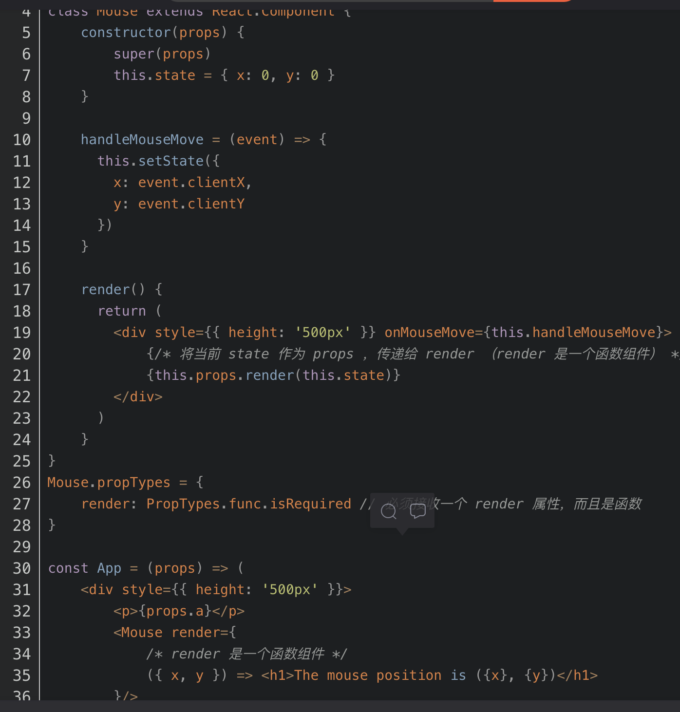
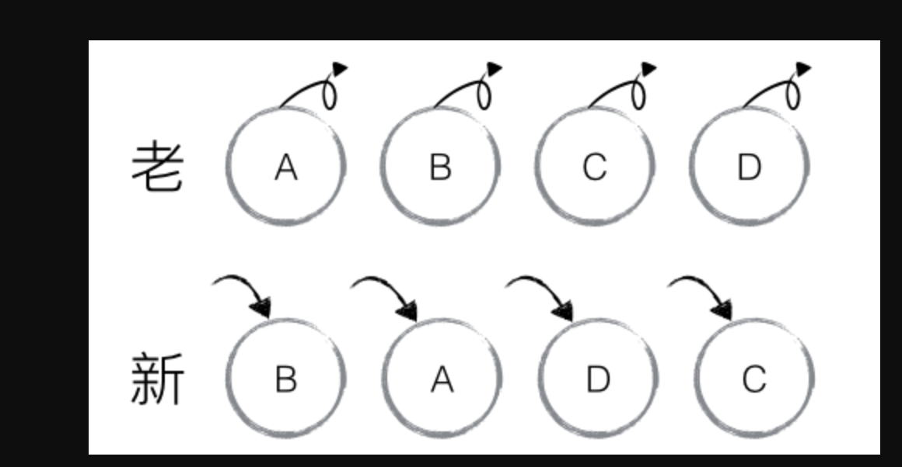

### memoizedState
- 每个react组件都有一个fiber节点，包含memoizedState，用于创建输出的fiber状态。处理更新时，它会反映当前在屏幕上呈现的状态。

### [React生命周期](https://juejin.cn/post/6914112105964634119)
- 旧的生命周期
  - 挂载
    - constructor
    - componentWillMount
    - render
    - componentDidMount
  - 更新
    - componentWillReceiveProps
    - shouldComponentUpdate
    - componentWillUpdate
    - render
    - componentDidUpdate
  - 卸载
    - componentWillUnmount
- 新的生命周期
  - 挂载
    - constructor：来初始化函数内部 state；为 事件处理函数 绑定实例
    - getDerivedStateFromProps：
      - static getDerivedStateFromProps(nextProps, state)，在调用 render方法之前调用，在初始化和后续更新都会被调用
      - 返回值：返回一个对象来更新 state, 如果返回 null 则不更新任何内容
      - 可以比较即将更新的props 和 上一个状态的state来加一些限制条件，防止无用的state更新
    - render
    - componentDidMount
  - 更新
    - getDerivedStateFromProps
    - shouldComponentUpdate
      - shouldComponentUpdate(nextProps, nextState)
      - 可以根据更新前后的 props 或 state 来比较加一些限制条件，决定是否更新，进行性能优化
      - 可以使用内置 PureComponent 组件替代
    - render
    - getSnapshotBeforeUpdate
      - 在最近一次渲染输出（提交到 DOM 节点）之前调用；在 render 之后，即将对组件进行挂载时调用。
      - 它可以使组件在 DOM 真正更新之前捕获一些信息（例如滚动位置），此生命周期返回的任何值都会作为参数传递给 componentDidUpdate()。如不需要传递任何值，返回 null
    - componentDidUpdate：componentDidUpdate(prevProps, prevState, snapshot)
  - 卸载
    - componentWillUnmount
      - 此生命周期是取消网络请求、移除监听事件、清理 DOM 元素、清理定时器等操作的好时机
- React从v16.3开始废弃 componentWillMount componentWillReceiveProps componentWillUpdate 三个钩子函数
- **废弃原因：因为React Fiber Reconciliation 这个过程有可能暂停然后继续执行，所以挂载和更新之前的生命周期钩子就有可能不执行或者多次执行；会产生副作用**
- 父子组件生命周期执行顺序总结：
  - 当子组件自身状态改变时，不会对父组件产生副作用的情况下，父组件不会进行更新，即不会触发父组件的生命周期
  - 当父组件中状态发生变化（包括子组件的挂载以及卸载）时，会触发自身对应的生命周期以及子组件的更新
    - **render  以及 render 之前的生命周期，则 父组件先执行**
    - **render 以及 render之后的声明周期，则子组件先执行，并且是与父组件交替执行**
    - 当子组件进行卸载时，只会执行自身的 componentWillUnmount 生命周期，不会再触发别的生命周期

#### setState 延迟处理，批量更新
- 为什么setState是批量更新的？
  - 如果每set一次，就渲染一次，这样更新效率很低，所以采用批量更新
- 函数式组件如何实现同步更新
  - useEffect实现同步数据更新
-  setState是伪异步，延迟执行；setState() 将对组件 state 的更改排入队列，并通知 React 需要使用更新后的 state 重新渲染此组件及其子组件。这是用于更新用户界面以响应事件处理器和处理服务器数据的主要方式。
- 源码解析
  - this.setState(newState),newState存入pending队列中，
  - 判断isBatchingUpdates（isBatchingUpdates表示是否进行批量更新，初始化时默认为false，batchedUpdates方法会将isBatchingUpdates设为true
），
  - Y保存于组件中dirtyComponents，
  - N遍历所有的dirtyComponents，调用updateComponent，更新pending state or props。
  - 调用setState()时，其实已经调用了ReactUpdates.batchedUpdates，此时isBatchingUpdates便是true。
  - isBatchingUpdates什么时候会置为false，true?
    - Transaction事务机制：
      - 一个 Transaction 就是将需要执行的 method 使用 wrapper（一组 initialize 及 close 方法称为一个 wrapper） 封装起来，再通过 Transaction 提供的 perform 方法执行。
      - 在 perform 之前，先执行所有 wrapper 中的 initialize 方法；perform 完成之后（即 method 执行后）再执行所有的 close 方法，而且 Transaction 支持多个 wrapper 叠加。
    - 批量更新策略：其实就是一个批量更新策略事务，它的 wrapper 有两个：FLUSH_BATCHED_UPDATES 和 RESET_BATCHED_UPDATES。
    - **isBatchingUpdates 在 React 的生命周期函数以及合成事件执行前，已经被 React 改为 true；在批量更新策略事务的 close 方法被复位为 false**


```js
handleClick = () => {
  // isBatchingUpdates = true
  this.setState({
    count: this.state.count + 1,
  })
  console.log(this.state.count) // 1

  this.setState({
    count: this.state.count + 1,
  })
  console.log(this.state.count) // 1

  this.setState({
    count: this.state.count + 1,
  })
  console.log(this.state.count) // 1
  // isBatchingUpdates = false
}


handleClick = () => {
  // isBatchingUpdates = true
  this.setState({
    count: this.state.count + 1,
  })
  console.log(this.state.count) // 1

  this.setState({
    count: this.state.count + 1,
  })
  console.log(this.state.count) // 1

  setTimeout(() => {
    // setTimeout异步执行，此时 isBatchingUpdates 已经被重置为 false
    this.setState({
      count: this.state.count + 1,
    })
    console.log(this.state.count) // 3
  })
  // isBatchingUpdates = false
}
```
- 总结：
  - 在 React 钩子函数及合成事件中，它表现为异步；
  - 而在 setTimeout/setInterval 函数，DOM 原生事件中，它都表现为同步。这是由 React 事务机制和批量更新机制的工作方式来决定的。
### 函数组件和类组件区别
- 函数式组件捕获了渲染所使用的值
- 因为类组件中类方法从 this.props.user 中读取数据。在 React 中 Props 是不可变(immutable)的，所以他们永远不会改变。然而，this是，而且永远是，可变(mutable)的。解决方案：利用闭包，即将方法，变量都写到render里面
```js
class ProfilePage extends React.Component {
  render() {
    // Capture the props!
    const props = this.props;

    // Note: we are *inside render*.
    // These aren't class methods.
    const showMessage = () => {
      alert('Followed ' + props.user);
    };

    const handleClick = () => {
      setTimeout(showMessage, 3000);
    };

    return <button onClick={handleClick}>Follow</button>;
  }
}
```
- 在默认情况下React中的函数会捕获props和state。但是如果我们想要读取并不属于这一次特定渲染的，最新的props和state呢？如果我们想要“从未来读取他们”呢？利用useRef

### pureComponent和memo的区别
https://knightyun.github.io/2021/05/09/js-react-purecomponent
- shouldComponentUpdate：是 React 的生命周期函数之一，它会在每次渲染（render）之前被调用，并且根据该函数的返回值（true/false）来决定是否调用渲染函数（return true 触发渲染，return false 阻止渲染），但是组件的首次渲染或者调用 forceUpdate() 方法时不会触发调用 shouldComponentUpdate 方法；该生命周期函数的默认行为是在每次 state 发生变化时触发重新渲染，如果自行声明该函数会覆盖这一默认行为，需要自行判断 state 的变化以决定是否重新渲染；
```js
class MyComponent extends React.Component {
  state = { count: 0 };

  shouldComponentUpdate(nextProps, nextState) {
    // 无需手动更新 state 值，组件会自动更新
    // this.setState({ ...nextState });

    if (nextState.count <= 3) {
      // count 值大于 3 后，组件便不再更新
      return true;
    } else {
      return false;
    }
  }

  render() {
    const { count } = this.state;
    return (
      <button onClick={() => this.setState({ count: count + 1 })}>
        {count}
      </button>
    );
  }
}
```
- PureComponent：React.PureComponent 类似于我们常用的 React.Component，区别在于**PureComponent 的内置 shouldComponentUpdate 逻辑，它会同时对 props 和 state 的变化前和变化后的值进行浅对比，如果都没发生变化则会跳过重渲染，相当于多了一层 props 对比。**
  - 子组件更新问题：PureComponent 确实可以在传入 props 值没有变化时避免重新渲染，在一些场景下优化性能，但是这也是使用 PureComponent 的一个前提，即需要组件在相同 props 传入值的情况下总会有相同的渲染内容，也就是纯组件中 Pure 的含义所在，它有些类似纯函数的定义（传入相同的参数执行后，总会得到相同的返回值）；从另一个方面来说，就是 **PureComponent 跳过渲染时，它的所有子组件也会跳过渲染，即使子组件应被更新，所以需要保证纯组件的所有子组件也都是纯组件**
- 浅对比问题：PureComponent 是对 props 的变化前后的值进行浅对比来决定是否重渲染组件，实际上就是对每个 props 值进行基本的值对比，**如果值类型是复杂类型，如引用类型（对象），并不会深入遍历每个属性的变化**
- React.memo：React.memo 是一个类似 PureComponent 的高阶组件，只不过它用于函数组件，而 PureComponent 用于类（class）组件，但二者的实际展示与优化效果是一致的.
```js
// 类组件
class ConstText1 extends React.PureComponent {
  render() {
    const { count } = this.props;
    console.log('pure rendered', count);
    return <div>pure: {count}</div>;
  }
}

// 函数组件
const ConstText2 = React.memo(function(props) {
  const { count } = props;
  console.log('const rendered', count);
  return <div>{count}</div>
});
```

### 合成事件
https://juejin.cn/post/6922444987091124232
https://toutiao.io/posts/28of14w/preview
- 问题：事件合成原理，处理什么问题，所以在挂载到document吗，事件优先级怎么判断，比如父元素子元素，原生事件是先捕获还是冒泡，同一个元素绑定onclick和addEventListener，哪一个先触发
- 合成事件：**在生成fiber节点的时候，与之对应的dom节点还有可能未挂载，onclick这样的事件处理函数作为fiber节点的prop，也就不能直接被绑定到真实的DOM节点上。因此react提供了事件注册、事件触发、事件执行机制。**
    - 对事件进行归类，可以在事件产生的任务上包含不同的优先级
    - 提供合成事件对象，抹平浏览器的兼容性差异
- 合成事件和原生事件的执行顺序
    - **V17 之前，合成事件和原生事件的执行顺序与冒泡/捕获模式无关，原生事件恒早于合成事件；**
    - **V17 后，合成事件和原生事件的执行顺序与冒泡/捕获模式相关，冒泡模式，原生事件早于合成事件，捕获模式，合成事件早于原生事件。**
    - **原生事件阻止冒泡肯定会阻止合成事件的触发。合成事件的阻止冒泡不会影响原生事件。**
- 事件注册：**与之前版本不同，React17的事件是注册到root上而非document**
   - 注册步骤：
        - **根据React的事件名称寻找该事件依赖**，例如onMouseEnter事件依赖了mouseout和mouseover两个原生事件，onClick只依赖了click一个原生事件，最终会循环这些依赖，在root上绑定对应的事件。例如组件中为onClick，那么就会在root上绑定一个click事件监听。
        - **依据组件中写的事件名识别其属于哪个阶段的事件（冒泡或捕获）**，例如onClickCapture这样的React事件名称就代表是需要事件在捕获阶段触发，而onClick代表事件需要在冒泡阶段触发。
        - **根据React事件名，找出对应的原生事件名**例如click，并根据上一步来判断是否需要在捕获阶段触发，调用addEventListener，将事件绑定到root元素上。
        - **若事件需要更新，那么先移除事件监听，再重新绑定，绑定过程重复以上三步。**
   - 事件监听器listener，事件优先级：是根据事件的交互程度划分的，优先级和事件名的映射关系存在于一个Map结构中。createEventListenerWrapperWithPriority会根据事件名或者传入的优先级返回不同级别的事件监听包装器。
        - 事件处理函数不是绑定到组件的元素上的，而是绑定到root上，这和fiber树的结构特点有关，即事件处理函数只能作为fiber的prop。listener是createEventListenerWrapperWithPriority的调用结果
        - 绑定到root上的事件监听不是我们在组件里写的事件处理函数，而是一个持有事件优先级，并能传递事件执行阶段标志的监听器。
    - 透传事件执行阶段标志：createEventListenerWrapperWithPriority函数中的其中一个入参：eventSystemFlags。它是事件系统的一个标志，记录事件的各种标记，其中一个标记就是IS_CAPTURE_PHASE，这表明了当前的事件是捕获阶段触发。当事件名含有Capture后缀时，eventSystemFlags会被赋值为IS_CAPTURE_PHASE
- **事件触发：负责以不同的优先级权重来触发真正的事件流程，并传递事件执行阶段标志**
  - **事件对象的合成和事件的收集**
  - **创建合成事件对象**：new SyntheticEvent
  - **收集事件到执行路径（在React中也是如此，从触发事件的元素开始，依据fiber树的层级结构向上查找，累加上级元素中所有相同类型的事件，最终形成一个具有所有相同类型事件的数组，这个数组就是事件执行路径。**通过这个路径，React自己模拟了一套事件捕获与冒泡的机制。）
- 事件执行：
    - **冒泡和捕获的执行顺序是不一样的，但是当初在收集事件的时候，无论是冒泡还是捕获，事件都是直接push到路径里的。**
    ```js
    <div onClick={onClickParent}>
    父元素
    <div onClick={onClickChild}>
        子元素
    </div>
    </div>
    listeners: [ onClickChild, onClickParent ]
    ```
    - **从左往右循环的时候，目标元素的事件先触发，父元素事件依次执行，这与冒泡的顺序一样，那捕获的顺序自然是从右往左循环了。其中判断事件执行阶段的依据inCapturePhase**

- 总结：**由于fiber树的特点，一个组件如果含有事件的prop，那么将会在对应fiber节点的commit阶段绑定一个事件监听到root上，这个事件监听是持有优先级的，这将它和优先级机制联系了起来，可以把合成事件机制当作一个协调者，负责去协调合成事件对象、收集事件、触发真正的事件处理函数这三个过程。**
```js
const domContainer = document.querySelector('#root')

// 绑定在外层的原生点击事件 非documemt层
domContainer.addEventListener('click', e => {
  console.log('root click')
})

class InnerDom extends React.Component {
  componentDidMount () {
      document.addEventListener('click', () => {
      console.log('document click')
    })
  }

  outClick = (e) => {
    console.log('out dom click')
  }

  innerClick = (e) => {
    // e.stopPropagation();
    //e.nativeEvent.stopImmediatePropagation()
    console.log('inner dom click')
  }

  render () {
    return <div onClick={this.outClick}>
      outter
      <div onClick={this.innerClick} > inner</div>
    </div>
  }
}

ReactDOM.render(<InnerDom />, domContainer)

"root click"
"inner dom click"
"out dom click"
"document click"

```
- 阻止冒泡事件分三种情况
  - **阻止合成事件间的冒泡，可以直接使用e.stopPropagation()**
  - **阻止合成事件与最外层 document 上的事件间的冒泡，用e.nativeEvent.stopImmediatePropagation()**
  - **阻止合成事件与除最外层 document 上的原生事件上的冒泡，通过判断e.target来避免**
- **事件优先级**
  - **离散事件（DiscreteEvent）：click、keydown、focusin等，这些事件的触发不是连续的，优先级为0。**对应dispatchDiscreteEvent包装器
  - **用户阻塞事件（UserBlockingEvent）：drag、scroll、mouseover等，特点是连续触发，阻塞渲染，优先级为1。**对应dispatchUserBlockingUpdate包装器
  - **连续事件（ContinuousEvent）：canplay、error、audio标签的timeupdate和canplay，优先级最高，为2。**对应dispatchEvent包装器

### 高阶组件：高阶组件是参数为组件，返回值为新组件的函数
https://www.cnblogs.com/WindrunnerMax/p/14438610.html4
- 概念：高阶组件（HOC）是 React 中用于复用组件逻辑的一种高级技巧。HOC 自身不是 React API 的一部分，它是一种基于 React 的组合特性而形成的设计模式。**组件是将 props 转换为 UI，而高阶组件是将组件转换为另一个组件。HOC 是纯函数，没有副作用。**
```js
const CommentListWithSubscription = withSubscription(
  CommentList,
  (DataSource) => DataSource.getComments()
);

const BlogPostWithSubscription = withSubscription(
  BlogPost,
  (DataSource, props) => DataSource.getBlogPost(props.id)
);
function withSubscription(WrappedComponent, selectData) {
  // ...并返回另一个组件...
  return class extends React.Component {
    constructor(props) {
      super(props);
      this.handleChange = this.handleChange.bind(this);
      this.state = {
        data: selectData(DataSource, props)
      };
    }

    componentDidMount() {
      // ...负责订阅相关的操作...
      DataSource.addChangeListener(this.handleChange);
    }

    componentWillUnmount() {
      DataSource.removeChangeListener(this.handleChange);
    }

    handleChange() {
      this.setState({
        data: selectData(DataSource, this.props)
      });
    }

    render() {
      // ... 并使用新数据渲染被包装的组件!
      // 请注意，我们可能还会传递其他属性
      return <WrappedComponent data={this.state.data} {...this.props} />;
    }
  };
}

```
- 两种实现形式：
  - **属性代理：返回传入的组件，透传自身无关的属性**
  - **反向继承：继承传入的组件。在反向继承中我们可以做非常多的操作，修改state、props甚至是翻转Element Tree，反向继承有一个重要的点，反向继承不能保证完整的子组件树被解析，也就是说解析的元素树中包含了组件(函数类型或者Class类型)，就不能再操作组件的子组件了。**
  ```js
  const HOC = (WrappedComponent) => {
    return class EnhancedComponent extends WrappedComponent {
        render() {
            return this.props.isRender && super.render();  
        }
    }
  }
  ```
- 注意事项：
  - 不要改变原始组件。不要试图在 HOC 中修改组件原型（或以其他方式改变它）即prototype原型
  - 过滤props。HOC 应该透传与自身无关的 props，即过滤掉非此 HOC 额外的 props，且不要进行透传
  - 最大化可组合性
  - 不要在 render 方法中使用 HOC。这不仅仅是性能问题 - 重新挂载组件会导致该组件及其所有子组件的状态丢失。如果在组件之外创建 HOC，这样一来组件只会创建一次。因此，每次 render 时都会是同一个组件。在极少数情况下，你需要动态调用 HOC。你可以在组件的生命周期方法或其构造函数中进行调用。
  - 务必复制静态方法。可以使用 hoist-non-react-statics 自动拷贝所有非 React 静态方法
  ```js
  import hoistNonReactStatic from 'hoist-non-react-statics';
  function enhance(WrappedComponent) {
    class Enhance extends React.Component {/*...*/}
    hoistNonReactStatic(Enhance, WrappedComponent);
    return Enhance;
  }
  ```
  - Refs 不会被传递。ref 实际上并不是一个 prop - 就像 key 一样，它是由 React 专门处理的。如果将 ref 添加到 HOC 的返回组件中，则 ref 引用指向容器组件，而不是被包装组件，这个问题的解决方案是通过使用 React.forwardRef


### React组件复用的方式
- Mixin
- HOC
- **Render Props：是指一种在 React 组件之间使用一个值为函数的 prop 共享代码的简单技术。**具有 render prop 的组件接受一个返回 React 元素的函数，并在组件内部通过调用此函数来实现自己的渲染逻辑。render prop 是一个用于告知组件需要渲染什么内容的函数 prop。
  - 存在问题：数据流向更直观了，子孙组件可以很明确地看到数据来源，但本质上**Render Props是基于闭包实现的，大量地用于组件的复用将不可避免地引入了callback hell问题。**
  - **丢失了组件的上下文，因此没有this.props属性，不能像HOC那样访问this.props.children**

- Hook：Hook 是 React 16.8 的新增特性。**它可以让你在不编写 class 的情况下使用 state 以及其他的 React 特性。**
  - 与其他的相比，在于细粒度代码复用不应该与组件复用捆绑在一起，HOC、Render Props等基于组件组合的方案，相当于先把要复用的逻辑包装成组件，再利用组件复用机制实现逻辑复用，自然就受限于组件复用，因而出现扩展能力受限、Ref隔断、Wrapper Hell等问题。Hooks让组件内逻辑复用不再与组件复用捆绑在一起，是真正在从下层去尝试解决(组件间)细粒度逻辑的复用问题此外，这种声明式逻辑复用方案将组件间的显式数据流与组合思想进一步延伸到了组件内。
  - 优点：
    - **不会产生组件嵌套**
    - **变量作用域明确**
    - **实现思路完全贴合工具函数封装的方式，容易理解，便于实现**
  - 缺点：
    - **写法上有限制(不能出现在条件、循环中)，并且写法限制增加了重构成本**
    - **破坏了PureComponent、React.memo浅比较的性能优化效果，为了取最新的props和state，每次render()都要重新创建事件处函数。**

### Hook与composition api区别
- Vue Composition API：**闭包变量、响应式的依赖追踪**
- React Hooks: **是一种函数，该函数允许您从函数式组件“勾住”React状态和生命周期功能，hooks在类内部不起作用**
- **React hooks 会在组件每次渲染时候运行，而 Vue setup() 只在组件创建时运行一次**
- **setup 函数是一个新的组件选项。作为在组件内使用 Composition API 的入口点。**
   - 调用时机：创建组件实例，然后初始化 props ，紧接着就调用setup 函数。从生命周期钩子的视角来看，它会在 beforeCreate 钩子之前被调用
   - 如果 setup 返回一个对象，则对象的属性将会被合并到组件模板的渲染上下文
   - ref() 返回一个反应式对象，其内部值可通过其 value 属性被访问到。可以将其用于基本类型，也可以用于对象，在后者的情况下是深层反应式的。
   - 接收一个普通对象然后返回该普通对象的响应式代理。等同于 2.x 的 Vue.observable()。响应式转换是“深层的”：会影响对象内部所有嵌套的属性。基于 ES2015 的 Proxy 实现，返回的代理对象不等于原始对象。建议仅使用代理对象而避免依赖原始对象。
   - isRef() 可被用来条件性地获取 value 属性（比如 isRef(myVar) ? myVar.value : myVar）。
   - toRefs() 则将反应式对象转换为普通对象，该对象上的所有属性都自动转换为 ref。

- 如何跟踪依赖：
  - **useEffect第二个参数。useEffect hook 允许我们在每次渲染之后运行某些副作用**（如请求数据或使用 storage 等 Web APIs），并视需要在下次执行回调之前或当组件卸载时运行一些清理工作。useCallback 和 useMemo 也使用依赖项数组参数，以分别决定其是否应该返回缓存过的（ memoized）与上一次执行相同的版本的回调或值。
  - **Vue Composition API 中setup可以使用 watch() 执行副作用以响应状态或属性的改变。多亏了 Vue 的反应式系统，依赖会被自动跟踪，注册过的函数也会在依赖改变时被反应性的调用。**
- 生命周期
  - 如果你熟悉 React 类生命周期方法，那么**可以将 useEffect Hook 视为 componentDidMount、componentDidUpdate 及 componentWillUnmount 的合集**
  - **Vue Component API，让我们通过 onMounted、onUpdated 和 onBeforeUnmount 等仍可以访问 生命周期钩子**
- 自定义代码
  - 都使用use作为前缀。组合式函数（Composition Functions）与 Hooks 在逻辑提取和重用的目标上是一致的。根据约定，组合式函数也像 React Hooks 一样使用 use 作为前缀以明示作用，并且表面该函数用于 setup() 中
- Refs
  - 根据约定，组合式函数也像 React Hooks 一样使用 use 作为前缀以明示作用，并且表面该函数用于 setup() 中
- 附加的函数
  - React Hooks 在每次渲染时都会运行，所以没有需要有一个等价于 Vue 中 computed 函数的方法。你可以自由地声明一个变量，其值基于状态或属性，并将指向每次渲染后的最新值
  - 在 Vue 的情况下，setup() 只运行一次。因此需要定义计算属性，其应该观察某些状态更改并作出相应的更新即computed
- Context 和 provide/inject
  - React 中的 useContext hook，可以作为一种读取特定上下文当前值的新方式。返回的值通常由最靠近的一层 <MyContext.Provider> 祖先树的 value 属性确定。其等价于一个类中的 static contextType = MyContext ，或是 <MyContext.Consumer> 组件
  - Vue 有一个类似的 API 叫做 provide/inject。它在 Vue 2.x 中作为组件选项存在，而在 Composition API 中增加了一对用在 setup() 中的 provide 和 inject 函数
- 在渲染上下文中暴露值
  - 在 React 的情况下，因为所有 hooks 代码都在组件定义中，且你将在同一个函数中返回要渲染的 React 元素，所以你对作用域中的任何值拥有完全访问能力
  - 在 Vue 的情况下，你要在 template 或 render 选项中定义模板；如果你使用单文件组件，就要从 setup() 中返回一个包含了你想输出到模板中的所有值的对象。由于要暴露的值很可能过多，你的返回语句也容易变得冗长

### react diff
- **传统diff算法：时间复杂度On的3次方；react diff算法时间复杂度为On**
- diff详解
  - **tree diff**
    - **React对树进行分层比较，两棵树只会对同一层次的节点进行比较。React 通过 updateDepth 对 Virtual DOM 树进行层级控制，只会对相同层级的 DOM 节点进行比较，即同一个父节点下的所有节点。当发现节点已经不存在时，则该节点及其子节点会被完全删除，不会用于进一步的比较。** 这样只需要对树进行一次遍历，便能完成整个 DOM 树的比较。
    - 性能提升：React 官方建议不要进行 DOM 节点跨层级的操作
  - **component diff**
    - **如果是同一类型的组件，按照原策略继续比较 virtual DOM tree。**
    - 如果不是，则将该组件判断为 dirty component，从而替换整个组件下的所有子节点。
    - **对于同一类型的组件，有可能其 Virtual DOM 没有任何变化，如果能够确切的知道这点那可以节省大量的 diff 运算时间，因此 React 允许用户通过 shouldComponentUpdate() 来判断该组件是否需要进行 diff。**
  - **element diff：INSERT_MARKUP（插入）、MOVE_EXISTING（移动）和 REMOVE_NODE（删除）**
    - INSERT_MARKUP，新的 component 类型不在老集合里， 即是全新的节点，需要对新节点执行插入操作。
    - MOVE_EXISTING，在老集合有新 component 类型，且 element 是可更新的类型，generateComponentChildren 已调用 receiveComponent，这种情况下 prevChild=nextChild，就需要做移动操作，可以复用以前的 DOM 节点。
    - REMOVE_NODE，老 component 类型，在新集合里也有，但对应的 element 不同则不能直接复用和更新，需要执行删除操作，或者老 component 不在新集合里的，也需要执行删除操作。
    - 场景解析：
      - 
      - 对比开始，有一个优化的原则：如果当前节点在新集合中的位置比老集合中的位置靠前的话，是不会影响后续节点操作的，所以，这种情况就不用管，这个被对比的节点不会动。具体到运算上，就是只要lastIndex < _mountIndex，就不会动这个节点了。这个lastIndex是访问过的位置的最大值，每对比一轮就会变化的，只是个数学参照。
      - 节点B：此时lastIndex=0,_mountIndex=1;满足lastIndex < _mountIndex，因此B节点不动，此时lastIndex = Math.max(_mountIndex, lastIndex)，就是1；
      - 节点A：此时lastIndex=1,_mountIndex=0;不满足lastIndex < _mountIndex，因此A节点进行移动操作，此时lastIndex = Math.max(_mountIndex, lastIndex)，还是1；
      - 节点D：此时lastIndex=1,_mountIndex=3;满足lastIndex < _mountIndex，因此D节点不动，此时lastIndex = Math.max(_mountIndex, lastIndex)，就是3；
      - 节点C：此时lastIndex=3,_mountIndex=2;不满足lastIndex < _mountIndex，因此C节点进行移动操作，当前已经比较完了
    - **性能提升：对同一层级的同组子节点，添加唯一 key 进行区分，从而提升 diff 性能**
- 总结
  - React 通过制定大胆的 diff 策略，将 O(n3) 复杂度的问题转换成 O(n) 复杂度的问题；
  - **React 通过分层求异的策略，对 tree diff 进行算法优化；**
  - **React 通过相同类生成相似树形结构，不同类生成不同树形结构的策略，对 component diff 进行算法优化；**
  - **React 通过设置唯一 key的策略，对 element diff 进行算法优化；**
  - **建议，在开发组件时，保持稳定的 DOM 结构会有助于性能的提升；**
  - **建议，在开发过程中，尽量减少类似将最后一个节点移动到列表首部的操作，当节点数量过大或更新操作过于频繁时，在一定程度上会影响 React 的渲染性能。**
  
- https://zhuanlan.zhihu.com/p/20346379?utm_source=wechat_session&utm_medium=social&utm_oi=757231104158617600
- https://zhuanlan.zhihu.com/p/140489744

### 如果你简历上面写vue 和react基本会问vue和react的区别，组件复用vue怎么做，react怎么做
- 核心思想不同
  - Vue早期定位是尽可能的降低前端开发的门槛。**Vue推崇灵活易用（渐进式开发体验），数据可变，双向数据绑定（依赖收集）。**
  - **以React推崇函数式编程（纯组件），数据不可变以及单向数据流。**
- 组件实现不同
  - **Vue源码实现是把options挂载到Vue核心类上，然后再new Vue({options})拿到实例。所以options api中的this指向内部Vue实例，对用户是不透明的，所以需要文档去说明this.$slot、this.$xxx这些api。**
  - **React内部实现比较简单，直接定义render函数以生成VNode，而React内部使用了四大组件类包装VNode，不同类型的VNode使用相应的组件类处理，职责划分清晰明了（后面的Diff算法也非常清晰）。**
- 响应式原理不同
  - Vue：**Vue依赖收集，自动优化，数据可变。Vue递归监听data的所有属性,直接修改。当数据改变时，自动找到引用组件重新渲染。**
  - React：**React基于状态机，手动优化，数据不可变，需要setState驱动新的State替换老的State。当数据改变时，以组件为根目录，默认全部重新渲染**
- diff算法不同
  - 相似处：
    - 不同的组件产生不同的 DOM 结构。当type不相同时，对应DOM操作就是直接销毁老的DOM，创建新的DOM。
    - 同一层次的一组子节点，可以通过唯一的 key 区分。
  - 不同处：
    - **Vue Diff使用双向链表，边对比，边更新DOM。**
    - **React主要使用diff队列保存需要更新哪些DOM，得到patch树，再统一操作批量更新DOM。**
- 事件机制不同
  - **Vue原生事件使用标准Web事件；Vue组件自定义事件机制，是父子组件通信基础**
  - **React原生事件被包装，所有事件都冒泡到顶层document/root监听，然后在这里合成事件下发。基于这套，可以跨端使用事件机制，而不是和Web DOM强绑定。React组件上无事件，父子组件通信使用props**

### 组件复用
- Mixins：面向对象中的mixin，本质就是属性/方法的拷贝
  - 首先Mixins引入了隐式的依赖关系, 尤其是引入了多个mixin甚至是嵌套mixin的时候，组件中属性/方法来源非常不清晰。
  - 其次Mixins可能会导致命名空间冲突,　所有引入的mixin都位于同一个命名空间，前一个mixin引入的属性/方法会被后一个mixin的同名属性/方法覆盖，这对引用了第三方包的项目尤其不友好
  - 嵌套Mixins相互依赖相互耦合，会导致滚雪球式的复杂性，不利于代码维护
- HOC：高阶函数
  - React：高阶组件就是一个接受组件函数，输出一个组件函数的Curry化的函数
  - Vue中实现HOC思路也是一样的，不过Vue中的输入/输出的组件不是一个函数或是类, 而是一个包含template/render选项的JavaScript对象
  - 缺陷：**首先和Mixins一样，HOC的props也会引入隐式的依赖关系；其次HOC的props可能会导致命名空间冲突, prop的同名属性/方法会被之后执行的HOC覆盖；** HOC需要额外的组件实例嵌套来封装逻辑，会导致无谓的性能开销
  - 优点：HOC是没有副作用的纯函数，嵌套也不会耦合；输出组件不和输入组件共享状态，也不能使用自身的setState直接修改输出组件的状态，保证了状态修改来源单一。
- Render Props
  - **React中的Render Props其本质就是把渲染函数传递给子组件**
  - **在Vue中Render Props对应的概念是插槽(slots)或是笼统地称为Renderless Components。**
  - 优势和缺陷：Render Props只是组件prop的一种用法，为了逻辑复用，需要将状态/视图的操作都封装到prop的这个渲染函数中，因此和HOC一样也会造成性能上的损耗。但是由于prop的属性只有一个，不会导致HOC prop名称冲突的问题
- Hooks优点：不难看出Hooks和Render Props的思想有些许的相似，只不过Render Props返回的是组件，Hooks返回的是一些状态(需要你自己传递给组件)。得益于Hooks这种细粒度的封装能力，渲染函数不再需要通过组件传递，修正了Render Props需要额外的组件实例嵌套来封装逻辑的缺陷。
- Vue中的Composition API

### 组件通信，context，zustand，props，redux


  ### React 16后部分生命周期要标上unSafe_
  https://zhuanlan.zhihu.com/p/150929928
  - **标题中的废弃不是指真的废弃，只是不建议继续使用，并表示在 V17.0 版本中正式删除。主要是这些生命周期方法经常被误用和滥用。并且在 React V16.0 之前，React 是同步渲染的，而在 V16.0 之后 React 更新了其渲染机制，是通过异步的方式进行渲染的，在 render 函数之前的所有函数都有可能被执行多次。**
  - 废弃 UNSAFE_componentWillMount 的原因：
    - 在该生命周期中写ajax，希望能早点拿到数据结果；但是实际上再怎么快也是在render后拿到数据结果
    - UNSAFE_componentWillMount 在服务器端渲染也会被调用到（此方法是服务端渲染唯一会调用的生命周期函数。），你肯定不希望 AJAX 请求被执行多次
    - Fiber 启用了异步渲染之后，更没有理由在 UNSAFE_componentWillMount 中进行 AJAX 请求了
    - 还有人会将事件监听器（或订阅）添加到 UNSAFE_componentWillMount 中，但这可能导致服务器渲染（永远不会调用 componentWillUnmount）和异步渲染（在渲染完成之前可能被中断，导致不调用 componentWillUnmount）的内存泄漏
  - 废弃 UNSAFE_componentWillReceiveProps 的原因
    - 有时候组件在 props 发生变化时会产生副作用。与 UNSAFE_componentWillUpdate 类似，UNSAFE_componentWillReceiveProps 可能在一次更新中被多次调用。因此，避免在此方法中产生副作用非常重要
    - 新的 getDerivedStateFromProps 实际上与 componentDidUpdate 一起取代了以前的 UNSAFE_componentWillReceiveProps 函数
  - 废弃 UNSAFE_componentWillUpdate 的原因
    - 在异步模式下使用 UNSAFE_componentWillUpdate 都是不安全的，因为外部回调可能会在一次更新中被多次调用。相反，应该使用 componentDidUpdate 生命周期，因为它保证每次更新只调用一次。
    - 大多数开发者使用 UNSAFE_componentWillUpdate 的场景是配合 componentDidUpdate，分别获取 rerender 前后的视图状态，进行必要的处理。但随着 React 新的 suspense、time slicing、异步渲染等机制的到来，render 过程可以被分割成多次完成，还可以被暂停甚至回溯，这导致 UNSAFE_componentWillUpdate 和 componentDidUpdate 执行前后可能会间隔很长时间，足够使用户进行交互操作更改当前组件的状态，这样可能会导致难以追踪的 BUG。
    - **getSnapshotBeforeUpdate 方法就是为了解决上述问题，因为 getSnapshotBeforeUpdate 方法是在 UNSAFE_componentWillUpdate 后（如果存在的话），在 React 真正更改 DOM 前调用的，它获取到组件状态信息更加可靠**；getSnapshotBeforeUpdate 还有一个十分明显的好处：它调用的结果会作为第三个参数传入 componentDidUpdate，避免了 UNSAFE_componentWillUpdate 和 componentDidUpdate 配合使用时将组件临时的状态数据存在组件实例上浪费内存，getSnapshotBeforeUpdate 返回的数据在 componentDidUpdate 中用完即被销毁，效率更高。

### react内部执行方式，在说一下屏幕更新前后的差别


### [React 运行时优化方案的演进](https://www.1024sou.com/article/543132.html)
- 几大框架设计思路
  - React 是一个重运行时的框架，在数据发生变化后，并没有直接去操作 dom，而是生成一个新的所谓的虚拟 dom，它可以帮助我们解决跨平台和兼容性问题，并且通过 diff 算法得出最小的操作行为，这些全部都是在运行时来做的。
  - Svelte 是重编译的框架，作为开发者我们只需要去写模版和数据，经过 Svelte 的编译和预处理，代码基本全部会解析成原生的 DOM 操作，Svelte 的性能也是最接近原生 js 的。
  - Vue 这个框架，在运行时和预编译取了一个很好地权衡，它保留了虚拟 dom，但是会通过响应式去控制虚拟 dom 的颗粒度，在预编译里面，又做了足够多的性能优化，做到了按需更新
- 编译时优化
  - Vue 使用的是模版语法，模版 的特点，就是语法受限，由于语法是可枚举的，所以它可以在预编译层面做更多的预判，让 Vue 在运行时有更好的性能。传统 vdom 的 Diff 算法总归要按照 vdom 树的层级结构一层一层的遍历，所以 diff 性能会和模版的大小正相关，跟动态节点的数量无关。在 Vue3.0 里有一条类似的优化策略，它的 compiler 可以根据节点的动态属性，为每个 虚拟 dom 创建不同的 patchflag，比如说，节点具有动态的 text，或者具有动态的 class，都会被打上不同的 patchflag。patchflag 再配合 block tree，就可以做到对不同节点的靶向更新。
  - Block tree 区块树：
    - 将模板基于动态节点指令切割为嵌套的区块
    - 每个区块内部节点是固定的
    - 每个区块只需要一个Array追踪自身包含的动态节点
- 运行时优化
  - 需要关注的问题
    - **CPU问题：主流浏览器的刷新频率一般是 60Hz，也就是每秒刷新 60 次，1/60s一次也就是16.6ms浏览器刷新一次。由于 GUI 渲染线程和 JS 线程是互斥的，所以 JS 脚本执行和浏览器布局、绘制不能同时执行。在这 16.6ms 的时间里，浏览器既需要完成 JS 的执行，也需要完成样式的重排和重绘，如果 JS 执行的时间过长，超出了 16.6ms，这次刷新就没有时间执行样式布局和样式绘制了，于是在页面上就会表现为卡顿。很多组件需要等待一些网络延迟，那么怎么样才能在网络延迟存在的情况下，减少用户对网络延迟的感知呢**
    - **IO问题：很多组件需要等待一些网络延迟，那么怎么样才能在网络延迟存在的情况下，减少用户对网络延迟的感知呢**
  - react几大版本演变
    - React 15：主要就是包含 Reconciler 和 Renderer；
      - 优点：引入了react批处理机制，setState是同步的，react里面调用setState更新state时之所以拿不到更新后的值是因为批处理机制。正是因为 setState 是同步的，当同时触发多次 setState 时浏览器会一直被JS线程阻塞，那么那么浏览器就会掉帧，导致页面卡顿，所以 React 才引入了批处理的机制，主要是为了将同一上下文中触发的更新合并为一个更新。
      - 缺陷：虽然在 React 15 中引入批处理这样的优化逻辑，但是由于 React 15 本身的架构是递归同步更新的，如果节点非常多，即使只有一次 state 变更，React 也需要进行复杂的递归更新，更新一旦开始，中途就无法中断，直到遍历完整颗树，才能释放主线程。
    - **React 16：主要就是包含 Reconciler 和 Renderer、Scheduler；**
      - 优点：提出了一个非常重要的概念，Concurrent Mode；Reconciler 这一层，使用 Fiber 架构进行了重构；render 函数产生的结果是 React element，而 Fiber 节点，由 React Element 创建而来。
      - react16更新过程：
        - **在 React 中最多会同时存在两棵Fiber树。当前屏幕上显示内容对应的Fiber树叫做 current Fiber 树，正在内存中构建的Fiber树叫做 workInProgress Fiber树，他们通过一个 alternate 属性连接。**
        - **React应用的根节点会使用一个 current 指针指向当前的 current Fiber 树。 当 workInProgress Fiber 树构建完成交给 Renderer 渲染在页面上后，应用根节点的 current 指针就会 指向 workInProgress Fiber 树，此时 workInProgress Fiber 树就变为 current Fiber 树。**
        - **由于 React 将渲染 DOM 树的机制改成了两个 Fiber 树交替工作的形式，所以可以在更新全部完成之后再切换指针指向，而在指针切换之前，我们随时可以放弃对另一颗树的修改。这，就让更新可中断成为了可能。**
      - **Reconciler 的工作就是使用 Diff 算法对比 current Fiber 和 React Element ，生成 workInProgress Fiber ，这个阶段是可中断的，Renderer 的工作是把 workInProgress Fiber 转换成真正的 DOM 节点。**
      - 调度器 - Scheduler
        - **当配合上面提到的时间切片，根据当前的宿主环境性能，为每个工作单元分配一个可运行时间，从而实现“异步可中断的更新”。**
        - **Scheduler将一次耗时很长的更新任务被拆分成一小段一小段的。这样浏览器就有剩余时间执行样式布局和样式绘制，减少掉帧的可能性。**
        - 由于兼容性和刷新帧率的问题，React 并没有直接使用 requestIdleCallback(不兼容IE和safari) ， 而是使用了 **MessageChannel(主流全部兼容) 模拟实现，原理是一样的。**
        - 浏览器一帧可用于执行js的时机
          ```js
          一个task(宏任务) -- 队列中全部job(微任务) -- requestAnimationFrame -- 浏览器重排/重绘 -- requestIdleCallback
          ```
        - MessageChannel比setTimeout执行时机更靠前，所以Scheduler将需要被执行的回调函数作为MessageChannel的回调执行。如果当前宿主环境不支持MessageChannel，则使用setTimeout
      - 中断更新
        - 在 React 的 render 阶段，开启 Concurrent Mode 时，每次遍历前，**都会通过 Scheduler 提供的 shouldYield 方法判断是否需要中断遍历，使浏览器有时间渲染。是否中断的判断依据，最重要的一点便是每个任务的剩余时间是否用完，shouldYield() 函数的作用就是检查时间是否到期。**deadline = currentTime + yieldInterval
        - yieldInterval 会根据当前设备的 fps 进行动态计算，帮助应用保持响应，并根据用户的设备性能和网速进行适当的调整。
      - isInputPending
        - 在 Chrome 87 版本，React 团队和 Chrome 团队合作，在浏览器上加入了一个新的 API isInputPending。这也是第一个将中断这个操作系统概念用于网页开发的API
      - 优先级控制：如果一次更新在运行过程中被中断，然后重新开始一次新的更新，我们可以说：后一次更新打断了前一次更新。
        - 分类
          - 如果是生命周期方法：是最高优先级、同步执行的。
          - 受控的用户输入：比如输入框内输入文字，同步执行。
          - 一些交互事件：比如动画，高优先级执行。
          - 其他：比如数据请求，或者使用了 suspense、transition 这样的更新，是低优先级执行的。
        - 任务优先级
          - ImmediatePriority 代表立即执行的优先级，级别最高。-1
          - UserBlockingPriority：代表用户阻塞级别的优先级。250
          - NormalPriority：这个就是最常见的正常的优先级.5000
          - LowPriority：代表较低的优先级.10000
          - IdlePriority： 优先级最低，表示任务是可以闲置的
        - **计算任务过期时间 expirationTime = startTime（当前时间）+ timeout**
          - 使用 runWithPriority 这个函数，涉及到优先级调度的地方
          - 通过不同的优先级变量，我们会计算得出不同时长的过期时间 expirationTime。每个更新任务都会有一个 expirationTime， 任务的过期时间离当前时间越近，说明这个任务的优先级越高。
          - 整个 React 应用呢，在同一时间可能会产生不同的任务，我们的 Scheduler 呢，就会优先帮我们找到最高优先级的任务，去调度它的更新。
      - 怎么才能最快的找到高优先级的任务呢？
        - **Scheduler 将所有已经准备就绪，可以执行的任务，都存在了一个叫 taskQueue 的队列中，而这个队列使用了小顶堆这种数据结构。在小顶堆中，所有的任务按照任务的过期时间，从小到大进行排列，这样 Scheduler 就可以只花费O(1)复杂度找到队列中最早过期，或者说最高优先级的那个任务。**
      - 生命周期的改变
        - **一个组件的渲染被分为两个阶段：第一个阶段（也叫做 render 阶段）是可以被 React 打断的，一旦被打断，这阶段所做的所有事情都被废弃，当 React 处理完紧急的事情回来，依然会重新渲染这个组件，这时候第一阶段的工作会重做一遍。**
        - **第二个阶段叫做 commit 阶段，一旦开始就不能中断，也就是说第二个阶段的工作会直接做到这个组件的渲染结束。两个阶段的分界点，就是 render 函数。** 开启 Concurrent Mode 之后， render 之前的所有生命周期都有可能会被打断，或者重复调用（componentWillMount、componentWillReceiveProps、componentWillUpdate）如果我们在这些生命中期中引入了副作用，被重复执行，就可能会给我们的程序带来不可预知的问题。因此React v16.3引入了一个新的生命周期函数 getDerivedStateFromProps，这个生命周期是一个 静态方法，在里面根本不能通过 this 访问到当前组件，输入只能通过参数，对组件渲染的影响只能通过返回值。
      - **React 16.6 新增了 <Suspense> 组件，它主要是解决运行时的 IO 问题。**
        - 使用 Suspense ，我们可以降低加载状的优先级，减少闪屏的问题。 比如数据很快返回的时候，我们可以不必显示加载状态，而是直接显示出来，避免闪屏；如果超时没有返回才显式加载状态。
      - React 16 的缺陷：虽然 React 16 的核心工作全部都是在 Concurrent Mode 上，但是这并不代表 Concurrent Mode 已经可以稳定使用了
    - react 17
      - 实现多版本共存
        - 在 React 17 中，React 会把事件 attach 到 React 渲染树的根 DOM 容器中，而不再 attach 到 document 级别。
          - React 采用的是 事件委托 的方式，它自己实现了一套事件机制，自己模拟了事件冒泡和捕获的过程，主要是为了抹平了各个浏览器的兼容性问题。
          - React 会直接在 document 节点上为每种事件类型 attach 一个处理器。这种方法不但在大型应用树上有性能优势，还会使添加新功能更容易。
          - 如果页面上有多个 React 版本，它们都会在 document 上注册事件。这会破坏 事件冒泡这些机制，外部的树仍然会接收到这个事件，这就使嵌套不同版本的 React 难以实现。这就是React 要改变 attach 事件到 DOM 的底层实现方式的原因。
      - lans
        - 背景：有 3 个任务, 其优先级 A > B > C；A 和 C 任务是 CPU 密集型，而 B 是IO密集型 （Suspense 会调用远程 api, 算是 IO 任务）， 即 A(cpu) > B(IO) > C(cpu)，在这种情况下呢，高优先级 IO 任务会中断低优先级 CPU 任务
        - **Lane 的类型，被定义为二进制变量**，这样，我们在做优先级计算的时候，用的都是位运算，在频繁更新的时候呢，占用内存少，计算速度也更快。越低优先级的 lanes 占用的位越多
    - react 18
      - createRoot：使用 ReactDOM.createRoot 创建的应用，就默认开启了并发渲染
      - 批处理的优化：React 18 开启了异步渲染可以解决有大量的状态更新要在异步回调执行的问题
      - startTransition：这个 API 可以让我们手动区分非紧急的状态更新，本质上还是对组件渲染优先级的控制。
  - 拓展
    - **Scheduler（调度器）—— 调度任务的优先级，高优任务优先进入 Reconciler**
    - **Reconciler（协调器）—— 负责找出变化的组件（使用 Fiber 重构）；负责调用 render 生成虚拟 Dom 进行 Diff，找出变化后的虚拟 Dom**
    - **Renderer（渲染器）—— 负责将变化的组件渲染到页面上；负责接到 Reconciler 通知，将变化的组件渲染在当前宿主环境，比如浏览器，不同的宿主环境会有不同的 Renderer。**