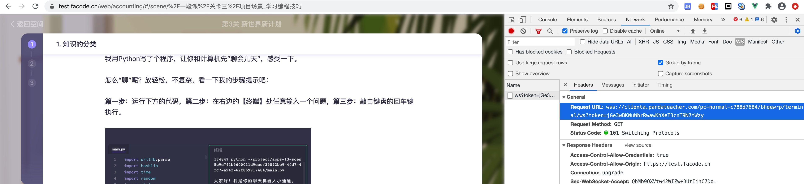
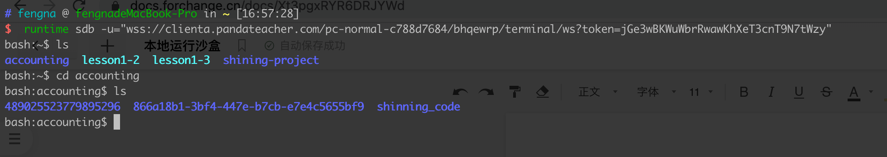

- 下载runtime文件
- 将runtime文件拷贝到/usr/local/bin 目录下
- 进入公司目前提供运行代码的系统，如财会小课测试环境，进入到代码运行那块，f12查看network，查看WS信息，找到并复制Request URL，如图

- 打开本地terminal，输入命令  runtime sdb -u="wss://clienta.pandateacher.com/pc-normal-c788d7684/bhqewrp/terminal/ws?token=jGe3wBKWuWbrRwawKhXeT3cnT9N7tWzy"
连接成功后如图：
