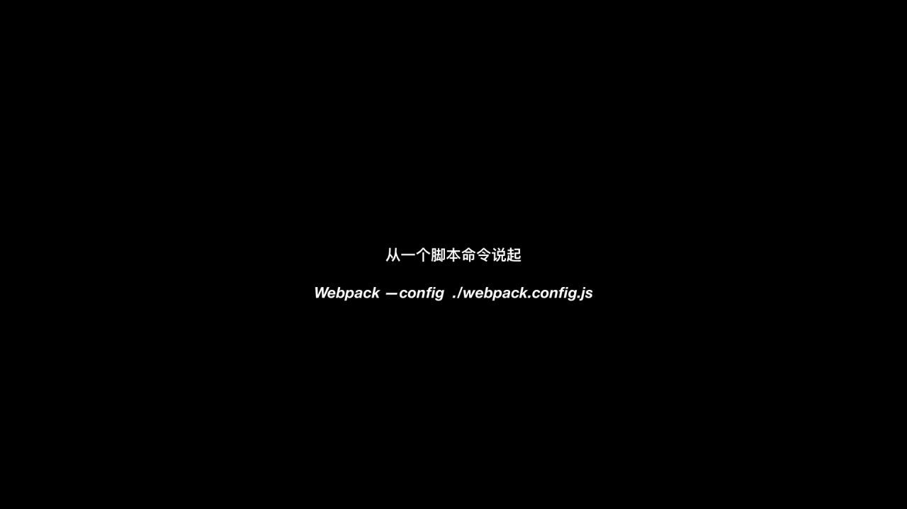
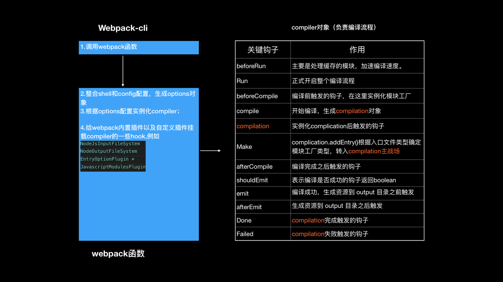
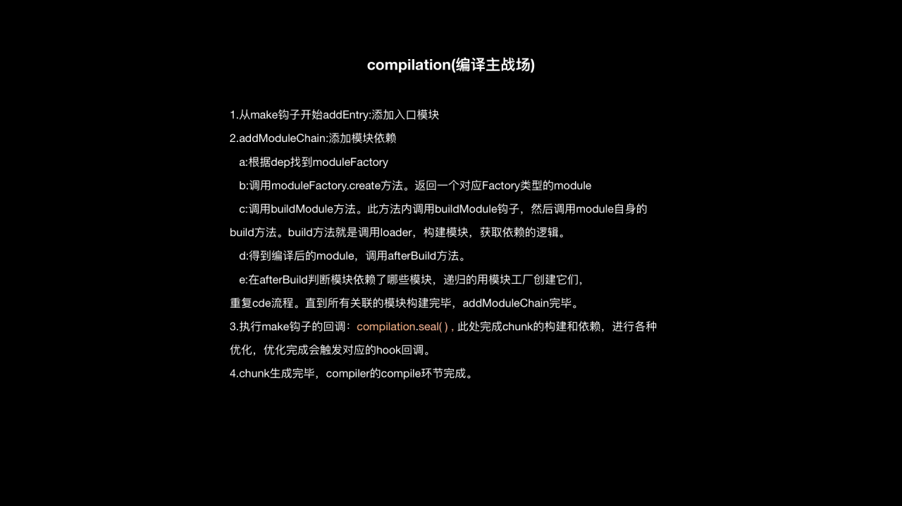
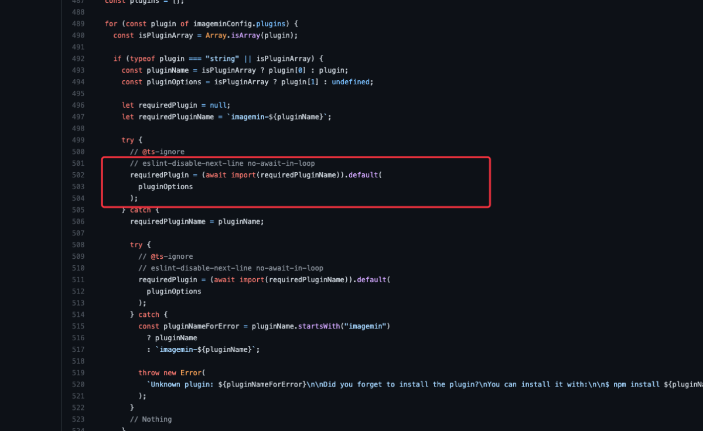

- 概念：`分析项目的结构，找到js模块以及其他的一些浏览器不能直接运行的拓展语言(scss,ts)，并将其打包成合适的格式以供浏览器使用`
- 优点：在webpack看来一切都是模块。包括你的JavaScript代码，也包括CSS和fonts以及图片等等，只有通过合适的loaders，它们都可以被当做模块被处理。

### entry：入口文件指是webpack应用哪个模块作为依赖图的开始，默认值是./src/index.js
### output：告诉webpack在哪里输出它所创建的bundle，以及如何命名这些文件。默认值是 ./dist/main.js

### 什么是ast
- Abstract Syntax Tree抽象语法树（通常被简写成AST）实际上只是一个解析树(parse tree)的一个精简版本。在编译器设计的语境中，"AST" 和 "语法树"(syntax tree)是可以互换的。
- 什么是解析树呢？我们知道一棵解析树是包含代码所有语法信息的树型结构，它是代码的直接翻译。所以解析树，也被成为具象语法树（Concret Syntax Tree, 简称CST）;而抽象语法树，忽略了一些解析树包含的一些语法信息，剥离掉一些不重要的细节，所以它看起并不像解析树那么事无巨细，这也是AST名字中抽象一词的由来。

### [webpack：loader跟plugin区别，如何识别import require 语句？如何做匹配？](https://zhuanlan.zhihu.com/p/102385477)
```js
5 + (1 x 12)  // 例子

// 词法分析得到token序列
<CONST, 5>
<OPT, +>
<SLP, ->
<CONST, 1>
<OPT, *>
<CONST, 12>
<RLP, ->
// var result  =  5 + (1 * 12)

// AST
{
  "type": "Program",
  "body": [
    {
      "type": "VariableDeclaration",
      "declarations": [
          {
              "type": "VariableDeclarator",
              "id": {
                  "type": "Identifier",
                  "name": "result"
              },
              "init": {
                  "type": "BinaryExpression",
                  "operator": "+",
                  "left": {
                      "type": "Literal",
                      "value": 5,
                      "raw": "5"
                  },
                  "right": {
                      "type": "BinaryExpression",
                      "operator": "*",
                                           "left": {
                          "type": "Literal",
                          "value": 1,
                          "raw": "1"
                      },
                      "right": {
                          "type": "Literal",
                          "value": 12,
                          "raw": "12"
                      }
                  }
              }
          }
      ],
      "kind": "var"
    }
  ],

  // 词法分析阶段生成的token
[
  {
    "type": "Keyword",
    "value": "var"
  },
  {
    "type": "Identifier",
    "value": "result"
  },
  {
    "type": "Punctuator",
    "value": "="
  },
  {
    "type": "Numeric",
    "value": "5"
  },
  {
    "type": "Punctuator",
    "value": "+"
  },
  {
    "type": "Punctuator",
    "value": "("
  },
  {
    "type": "Numeric",
    "value": "1"
  }, {
    "type": "Punctuator",
    "value": "*"
  },
  {
    "type": "Numeric",
    "value": "12"
  },
  {
    "type": "Punctuator",
    "value": ")"
  },
  {
    "type": "Punctuator",
    "value": ";"
  }
]
```
- 词法分析：结合编译原理学过的，在扫描文件内容时，进行词法分析得到分解后的token序列
- 语法分析：分词阶段完成以后，token序列会经过我们的解析器，由解析器识别出代码中的各类短语，会根据语言的文法规则(rules of grammar)输出解析树，这棵树是对代码的树形描述。
- AST：将上面步骤的解析树中的某些文法规则EXP精简掉得到AST树
  - AST不含有语法细节，比如冒号、括号、分号
  - AST会压缩单继承节点
  - 操作符会变成内部节点，不再会以叶子节点出现在树的末端。


### loader
- 作用：处理任意类型文件，并且将它们转换成一个让webpack可以处理的有效模块。
- 加载单文件组件格式撰写的Vue组件 --> vue-loader 
- 加载css
  - 遍历匹配文件中的@import 和 url() --> css-loader
  - 通过 style 元素注入样式、实现了`热模块替换接口` --> style-loader
- webpack只能理解js和json，loader让webpack能去处理其他类型文件，并将他们转换成有效模块
- 各个loader配置在 module.rules ; 使用test正则匹配文件，不要添加引号，/\.txt$/ 跟 '/\.txt$/'不一样,前者是指任何以.txt结尾的文件，后者 匹配具有绝对路径 '.txt' 的单个文件
- 一个use包含了多个loader时，处理顺序应该是最后一个到第一个；
```js
{
    // 匹配.css文件
    test: /\.scss$/,
    use: ['style-loader', 'scss-loader']
},
/* SCSS 源代码会先交给 sass-loader 把 SCSS 转换成 CSS；
把 sass-loader 输出的 CSS 交给 css-loader 处理，找出 CSS 中依赖的资源、压缩 CSS 等；
把 css-loader 输出的 CSS 交给 style-loader 处理，转换成通过脚本加载的 JavaScript 代码；
*/

{
    test: /\.(png|jpe?g|gif|svg)(\?.*)?$/,
    loader: 'url-loader',
    options: {
      limit: 10000,
      name: utils.assetsPath('img/[name].[hash:7].[ext]')
    }
},
/*
url-loader会接收一个limit参数，单位字节byte
当文件体积小于limit时，url-loader会把文件转为Data URL 的格式内联到引用的地方；
当文件体积大于limit时，url-loader会调用file-loader，把文件存储到输出目录，并把引用的文件路径写成输出后的路径
*/
```
- `file-loader：把文件输出到一个文件夹中，在代码中通过相对 URL 去引用输出的文件 (处理图片和字体)`
- `url-loader：与 file-loader 类似，区别是用户可以设置一个阈值，大于阈值会交给 file-loader 处理，小于阈值时返回文件 base64 形式编码 (处理图片和字体)`
- `babel-loader：把 ES6 转换成 ES5`
- `ts-loader: 将 TypeScript 转换成 JavaScript`
-` sass-loader：将SCSS/SASS代码转换成CSS`
- `css-loader：加载 CSS，支持模块化、压缩、文件导入等特性`
- `style-loader：把 CSS 代码注入到 JavaScript 中，通过 DOM 操作去加载 CSS`
- `vue-loader：加载 Vue.js 单文件组件`

### Loader和Plugin的区别
- `Loader 本质就是一个函数`，在该函数中对接收到的内容进行转换，返回转换后的结果。 因为 Webpack 只认识 JavaScript，所以 Loader 就成了翻译官，`对其他类型的资源进行转译的预处理工作`。
- `Plugin 就是插件，基于事件流框架 Tapable，插件可以扩展 Webpack 的功能，`在 Webpack 运行的生命周期中会广播出许多事件，`Plugin 可以监听这些事件，在合适的时机通过 Webpack 提供的 API 改变输出结果`。


### plugin
- 热更新插件:webpack-hot-middleware

### Webpack构建流程
- 初始化参数：从配置文件和 Shell 语句中读取与合并参数，得出最终的参数
- 开始编译：用上一步得到的参数初始化 Compiler 对象，加载所有配置的插件，执行对象的 run 方法开始执行编译
- 确定入口：根据配置中的 entry 找出所有的入口文件
- 编译模块：从入口文件出发，调用所有配置的 Loader 对模块进行翻译，再找出该模块依赖的模块，再递归本步骤直到所有入口依赖的文件都经过了本步骤的处理
- 完成模块编译：在经过第4步使用 Loader 翻译完所有模块后，得到了每个模块被翻译后的最终内容以及它们之间的依赖关系
- 输出资源：根据入口和模块之间的依赖关系，组装成一个个包含多个模块的 Chunk，再把每个 Chunk 转换成一个单独的文件加入到输出列表，这步是可以修改输出内容的最后机会
- 输出完成：在确定好输出内容后，根据配置确定输出的路径和文件名，把文件内容写入到文件系统
- 总结：
  - `初始化：启动构建，读取与合并配置参数，加载 Plugin，实例化 Compiler`
  - `编译：从 Entry 出发，针对每个 Module 串行调用对应的 Loader 去翻译文件的内容，再找到该 Module 依赖的 Module，递归地进行编译处理`
  - `输出：将编译后的 Module 组合成 Chunk，将 Chunk 转换成文件，输出到文件系统中`
- 补充：打包过程中被操作的模块文件叫做chunk

### Webpack 的热更新原理
- `Webpack 的热更新又称热替换（Hot Module Replacement），缩写为 HMR。 这个机制可以做到不用刷新浏览器而将新变更的模块替换掉旧的模块。`
- HMR的核心就是`客户端从服务端拉取更新后的文件`，准确的说是 chunk diff (chunk 需要更新的部分)，实际上 `WDS(Webpack-dev-server) 与浏览器之间维护了一个 Websocket，当本地资源发生变化时，WDS 会向浏览器推送更新，并带上构建时的 hash，让客户端与上一次资源进行对比。客户端对比出差异后会向 WDS 发起 Ajax 请求来获取更改内容(文件列表、hash)，这样客户端就可以再借助这些信息继续向 WDS 发起 jsonp 请求获取该chunk的增量更新。`
- 后续的部分(拿到增量更新之后如何处理？哪些状态该保留？哪些又需要更新？)由 HotModulePlugin 来完成，提供了相关 API 以供开发者针对自身场景进行处理，像react-hot-loader 和 vue-loader 都是借助这些 API 实现 HMR。

### loader和plugin的区别
- loader 是文件加载器，能够加载资源文件，并对这些文件进行一些处理，诸如编译、压缩等，最终一起打包到指定的文件中。loader 运行在打包文件之前
  - 其本质为函数，函数中的 this 作为上下文会被 webpack 填充，因此我们不能将 loader设为一个箭头函数
  - 函数接受一个参数，为 webpack 传递给 loader 的文件源内容
  - 函数中 this 是由 webpack 提供的对象，能够获取当前 loader 所需要的各种信息
  - 函数中有异步操作或同步操作，异步操作通过 this.callback 返回，返回值要求为 string 或者 Buffer
- plugin 赋予了 webpack 各种灵活的功能，例如打包优化、资源管理、环境变量注入等，目的是解决 loader 无法实现的其他事。plugins 在整个编译周期都起作用
  - 插件必须是一个函数或者是一个包含 apply 方法的对象，这样才能访问compiler实例
  - 传给每个插件的 compiler 和 compilation 对象都是同一个引用，因此不建议修改
  - 异步的事件需要在插件处理完任务时调用回调函数通知 Webpack 进入下一个流程，不然会卡住

### webpack编译会创建两个核心对象：
- compiler：包含了 webpack 环境的所有的配置信息，包括 options，loader 和 plugin，和 webpack 整个生命周期相关的钩子
- compilation：作为 plugin 内置事件回调函数的参数，包含了当前的模块资源、编译生成资源、变化的文件以及被跟踪依赖的状态信息。当检测到一个文件变化，一次新的 Compilation 将被创建

### webpack性能优化
- resolve字段的配置
  - 避免重重查找；
  - 设置尽量少的值可以减少入口文件的搜索步骤；
  - 庞大的第三方模块设置resolve.alias, 使webpack直接使用库的min文件，避免库内解析
- 配置loader时，通过test、exclude、include缩小搜索范围
- 使用HappyPack开启多进程Loader转换
- 开启热更新：原理也是向每一个chunk中注入代理客户端来连接DevServer和网页
- 使用Tree Shaking剔除JS死代码

### webpack如何提取公共代码，原理
- SplitChunksPlugin
- DllPlugin：DLLPlugin 和 DLLReferencePlugin 用某种方法实现了拆分 bundles，同时还大大提升了构建的速度
- 常用的代码分离方法有三种：
  - 入口起点：使用 entry 配置手动地分离代码。
  - 防止重复：使用 Entry dependencies 或者 SplitChunksPlugin 去重和分离 chunk。
  - 动态导入：通过模块的内联函数调用来分离代码
### webpack拆包分包对性能有很大作用
- 怎么去做拆包分包提取公共代码？
  - optimization.splitChunks
- 怎么提公共模块更高效？
  - 可以设置cacheGroup
  - splitChunks.minSize：生成 chunk 的最小体积
  - splitChunks.minChunks：拆分前必须共享模块的最小 chunks 数
- 怎么判断一个模块是否需要被抽成公共模块？
  - 在打包的时候，应该把不同入口之间，共同引用的模块，抽离出来，放到一个公共模块中。这样不管这个模块被多少个入口引用，都只会在最终打包结果中出现一次。
- 拆分原则：
  - 业务代码和第三方库分离打包，实现代码分割；
  - 业务代码中的公共业务模块提取打包到一个模块；
  - 第三方库最好也不要全部打包到一个文件中，因为第三方库加起来通常会很大，我会把一些特别大的库分别独立打包，剩下的加起来如果还很大，就把它按照一定大小切割成若干模块。

### [Tree Shaking](https://webpack.docschina.org/guides/tree-shaking/) 
- 概念：Tree shaking 是一种通过清除多余代码方式来优化项目打包体积的技术
- 原理：`tree shaking 只能在静态modules下工作，es6模块加载是静态的，因此整个依赖树可以被静态地推导出解析语法树。所以在es6中使用tree shaking是非常容易的。`
- 背景：在es6以前使用CommonJS引入模块：require()，这种引入是动态的，意味着tree shaking 不适用。因为不确定哪些模块实际运行之前是需要的，或者是不需要的。在es6中，进入了完全静态的导入语法：import.

### side effects
- 概念：`side effects是指哪些当import的时候会执行一些动作，但是不一定会有任何export。`
- tree shaking不能自动识别哪些代码属于side effects，因此手动指定这些代码显得十分重要。
- 总结：
  - tree shaking 不支持动态导入(CommonJS的require()语法)，只支持纯静态的导入(es6的import())。
  - webpack中可以在项目的package.json文件中添加一个'sideEffects'属性，手动指定由副作用的脚本

### CommonJS
- 在 Commonjs 中，一个文件就是一个模块。定义一个模块导出通过 exports 或者 module.exports 挂载即可。
- 导入一个模块也很简单，通过 require 对应模块拿到 exports 对象。


### webpack工作流程
- 从一个脚本命令说起 Webpack -config ./webpack.config.js 
- webpack-cli
  - 调用webpack函数
  - 整合shell和config配置，生成options对象
  - 根据options配置实例化compiler
  - 给webpack内置插件以及自定义插件挂载compiler的一些hook，例如 NodeJsInputFileSystem、NodeOutputFileSystem、EntryOptionPlugin

- compiler对象（负责编译流程）
  - beforeRun  主要处理缓存的模块，加速编译速度
  - Run  正式开启整个编译流程
  - beforeCompile 编译前触发的钩子，在这里实例化模块工厂
  - compile 开始编译，生成compilation对象
  - compilation  实例化compilation后触发的钩子
  - Make  compilation.addEntry()根据入口文件类型确定模块工厂类型，转入compilation主战场
  - afterCompile 编译完成之后触发的钩子
  - shouldEmit 表示编译是否成功的钩子返回boolean
  - emit  编译成功，生成资源到output目录之后触发
  - done compilation成功后触发的钩子
  - failed compilation失败后触发的钩子


### Babel原理
- 解析：将代码转换成 AST
  - 词法分析：将代码(字符串)分割为token流，即语法单元成的数组
  - 语法分析：分析token流(上面生成的数组)并生成 AST
- 转换：访问 AST 的节点进行变换操作生产新的 AST
  - Taro就是利用 babel 完成的小程序语法转换
- 生成：以新的 AST 为基础生成代码


### 升级webpack4到webpack5
- 相关知识点
   - monorepo：
    - Menorepo的优点是可以在一个仓库里维护多个package，可统一构建，跨package调试、依赖管理、版本发布都十分方便，搭配工具还能统一生成CHANGELOG；
    - 缺点是代码仓库体积会变大，只开发其中一个package也需要安装整个项目的依赖。
   - yarn workspaces
    ```js
    {
      "private": true,
      "workspaces": ["workspace-a", "workspace-b"]
    }
    ```
    - 开发多个互相依赖的package时，workspace会自动对package的引用设置软链接（symlink），比yarn link更加方便，且链接仅局限在当前workspace中，不会对整个系统造成影响
      - 所有package的依赖会安装在最根目录的node_modules下，节省磁盘空间，且给了yarn更大的依赖优化空间
      - 所有package使用同一个yarn.lock，更少造成冲突且易于审查
  - 为什么webpack要压缩js,css,html和图片等资源？
      - 提升访问速度，压缩后可以减少网页体积，图片更小的话速度也会更快
  - package.json中peerDependencies作用
      -  peerDependencies 的目的是提示宿主环境去安装满足插件peerDependencies所指定依赖的包，然后在插件import或者require所依赖的包的时候，永远都是引用宿主环境统一安装的npm包，最终解决插件与所依赖包不一致的问题
  - yarn多版本打平依赖问题，pnpm不会打平依赖
      - 项目的node_modules文件夹只有当前package.json中所声明的各个依赖（的软连接），而真正的模块文件，存在于node_modules/.pnpm，由模块名@版本号形式的文件夹扁平化存储(解决依赖重复安装)。同时这样设计，也很好的避免了之前可以访问非法npm包的问题，因为当前项目的node_modules只有我们声明过的依赖，这也让node_modules里面的文件看起来非常的直观
  - optionalDependencies
      - 可选依赖，如果有一些依赖包即使安装失败，项目仍然能够运行或者希望npm继续运行，就可以使用optionalDependencies。另外optionalDependencies会覆盖dependencies中的同名依赖包，所以不要在两个地方都写。
      - 如果一个依赖关系可以被使用，但你希望npm在找不到它或安装失败的情况下继续进行，那么你可以把它放在optionalDependencies对象中。这是一个包名到版本或url的映射，就像依赖对象一样。不同的是，构建失败不会导致安装失败。
  - require.resolve.paths
  - file-type 检测文件类型，用于debug webpack相关包源码
  - webpack build使用production模式是因为生产模式做了很多代码优化之类的东西
  - chunk跟module的区别
      - module就是模块，和一般的js模块一样，一个模块一般是一个功能内聚，封装良好的文件，而chunk是webpack特有的，用来打包module，输出到bundle的，bundle就是module最后打包输出的文件
  - webpackChunkName
### webpack5 和 webpack4 的区别有哪些
- 压缩代码：内置了 terser-webpack-plugin 插件，我们不用再下载安装
- 内置了Tree Shaking，不需要在配置插件
- webpack5 内部内置了 cache 缓存机制
- 打包：webpack5打包:后续没有使用到的函数，不会将代码打包进去
- 输出代码：webpack4只能输出es5代码；webpack5新增属性output.ecmaVersion，可以生成ES5和ES6的代码
- webpack4默认使用md4的加密格式，而webpack5默认的是md5，会导致文件名对应不上

- 项目细节
  - link-to-chunk.ts 文件用import动态导入，配合/* webpackChunkName: "survey" */，生成一个单独的有意义的文件名，用来分析包的大小及优化；对比require形式，require是将所有的都打包到一个文件里
  - rollup.js https://zhuanlan.zhihu.com/p/75717476
- 问题
  - webpack5耗时比webpack4多半分钟？
    - 分析编译耗时、图片插件；
    - 尝试输出各个阶段编译耗时，开始编译的时间，找到问题，解决问题,使用file-type去定位content文件类型
    - 如果不行，就自己编写loader去处理压缩图片
    - 基于image-webpack-loader，参考image-minimizer-webpack-plugin 插件loader的写法，自己写一个loader
  - name 用md5的原因，不用md4
    - 小程序taro中默认的是使用webpack4打包，webpack4默认使用md4的加密格式，而webpack5默认的是md5，会导致文件名对应不上。athena-training-mina小程序的大型文件存储在athena-mobile-resource里面，athena-mobile-resource因为wdt工具升级到webpack5，变成md4，因此需要手动配置图片等资源的name为md5
  - 为什么webpack5加密方式变成了md4，而不是md5？
    - 因为node 17后采用了md4的加密算法，我们仓库采用的是node 12，还是md5的加密方式
  ```js
  ERROR in ../../../node_modules/.pnpm/registry.npmjs.org/image-size/1.0.0/node_modules/image-size/dist/index.js 14:13-28

  Module not found: Error: Can't resolve 'path' in '/Users/fengna/project/front-end/node_modules/.pnpm/registry.npmjs.org/image-size/1.0.0/node_modules/image-size/dist'
  ```
  - 打包环境分为浏览器环境和node平台环境，image-size应该是运行在node平台，而不是在浏览器平台。从 Can't resolve 'path' 可以看出来
  - 前提 import webpack from 'webpack';

  ```js 
  import WebpackDevServer from 'webpack-dev-server'; 改为const WebpackDevServer = require('webpack-dev-server');
  ```
  - 为什么要将import webpackDevServer导入方式改为require
  - 改为require后为什么有些配置项ts校验不通过？比如config.devServer

  ```js
  Error [ERR_MODULE_NOT_FOUND]: Cannot find module '...\node_modules\@babel\runtime-corejs3\core-js\object\define-property' imported from ...\node_modules\@babel\runtime-corejs3\helpers\esm\defineProperty.js
  ```
  - 解决方案：

  ```js
  { test: /\.m?js/, resolve: { fullySpecified: false } } // 取消强制输入扩展名Rule.resolve.fullySpecified: false
  ```
  - 升级ImageMinimizerPlugin时，取消绝对路径，由ImageMinimizerPlugin插件内部导入其他插件如imagemin-mozjpeg。
  - 如
  ```js
  new ImageMinimizerPlugin({minimizer: {implementation: ImageMinimizerPlugin.imageminMinify,options: {plugins: [[require.resolve('imagemin-mozjpeg')],[require.resolve('imagemin-pngquant'),{quality: [0.6, 0.8],},],],},},}),
  ```
  - 去掉require.resolve
  - 源码：image-minimizer-webpack-plugin 


