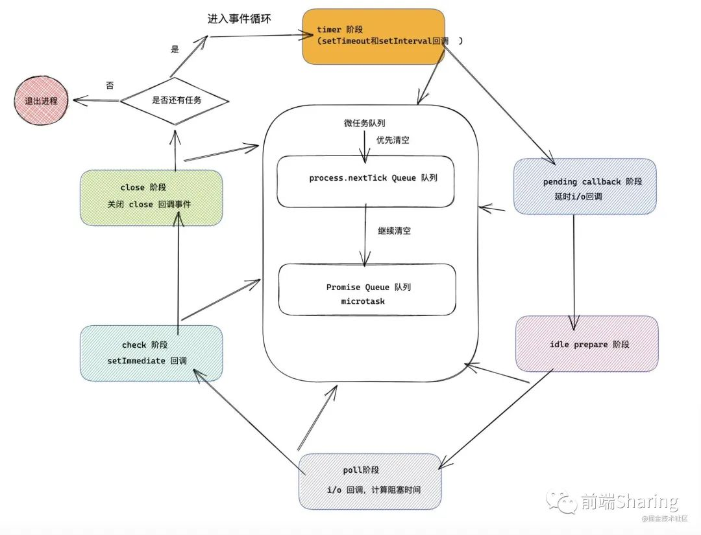

### V8执行JavaScript代码
- V8 依据 JavaScript 代码生成 AST 和执行上下文，再基于 AST 生成字节码，然后通过解释器执行字节码，通过编译器来优化编译字节码


### 浏览器事件循环机制
- js事件循环机制：
  - 所有同步任务都在主线程上执行，形成一个执行栈。
  - 主线程之外，还存在一个`任务队列`（task queue）。只要异步任务有了运行结果，就在"任务队列"之中放置一个事件。
  - 一旦`执行栈`中的所有同步任务执行完毕，系统就会读取`任务队列`，看看里面有哪些事件。那些对应的异步任务，于是结束等待状态，进入执行栈，开始执行。
  - 主线程不断重复上面的第三步。
  - 补充：异步任务细分为宏任务和微任务，`微任务优先级高于宏任务，所以微任务会先进入执行栈，然后再是宏任务进入执行栈，如此循环`
- 微任务：Process.nextTick、`Promise.then catch finally`、MutationObserver、async/await

- 与node事件循环机制的差异
  - 差异体现在nodeV10之前。`浏览器是执行完一个宏任务就会去清空微任务队列；node则是将同源的宏任务队列执行完毕后再去清空微任务队列；`另外,宏任务内若嵌套同源宏任务，仍会放进一个队列，但是执行将会放在下一次事件循环；
- `执行 : 先 同步，再 微任务 ，再 宏观任务`
- node 事件循环机制：事件循环机制由宿主环境实现
  - Nodejs 的事件循环有多个阶段，其中有一个专门处理 I/O 回调的阶段，每一个执行阶段我们可以称之为 Tick ， 每一个 Tick 都会查询是否还有事件以及关联的回调函数 ，如上异步 I/O 的回调函数，会在 I/O 处理阶段检查当前 I/O 是否完成，如果完成，那么执行对应的 I/O 回调函数。在 Nodejs 中，对应观察者接收对应类型的事件，事件循环过程中，会向这些观察者询问有没有该执行的任务，如果有，那么观察者会取出任务，交给事件循环去执行。
  - 事件循环阶段：每一个event loop都会包含按如下顺序六个循环阶段
    - timers 阶段: 这个阶段执行 setTimeout(callback) 和 setInterval(callback) 预定的 callback;
    - pending callback ，大部分 I/O 回调任务都是在 poll 阶段执行的，为了调用之前事件循环延迟执行的 I/O 回调函数。
    - idle prepare 阶段: 仅node内部使用;
    - poll 轮询阶段，这个阶段主要做两件事，一这个阶段会执行异步 I/O 的回调函数；二 计算当前轮询阶段阻塞后续阶段的时间。
    - check 阶段: 执行 setImmediate() 设定的callbacks;
    - close callbacks 阶段: 比如 socket.on(‘close’, callback) 的callback会在这个阶段执行;

- example
```js
console.log(1);

setTimeout(() => {
    console.log(2)
    new Promise((resolve) => {
        console.log(6);
        resolve(7);
    }).then((num) => {
        console.log(num);
        resolve(10)
    }).then((nums) => {
      console.log(nums)
    })
});

setTimeout(() => {
    console.log(3);
       new Promise((resolve) => {
        console.log(9);
        resolve(10);
    }).then((num) => {
        console.log(num);
    })
    setTimeout(()=>{
    	console.log(8);
    })
})

new Promise((resolve) => {
    console.log(4);
    resolve(5)
}).then((num) => {
    console.log(num);
    new Promise((resolve)=>{
    	console.log(11);
    	resolve(12);
      console.log(14444)
    }).then((num)=>{
    	console.log(num);
    })
})
```
- 答案：左边是浏览器运行结果，右边是node8运行结果


### 浏览器渲染流程
- 关键渲染路径：是指浏览器将HTML、CSS、JavaScript转化为屏幕上所呈现出来的元素所经历的一系列操作
- 渲染关键的五大步骤：构建DOM  构建CSSOM   构建渲染树   布局   绘制
  - `浏览器获取HTML并开始构建DOM`
  - `获取CSS并开始构建CSSOM`
  - `将DOM跟CSSOM结合，创建渲染树(Render tree)`
  - `布局，找到所有内容都处于网页哪个位置`
  - `绘制，浏览器开始在屏幕上绘制像素`
- DOMContentLoaded 事件触发代表初始的 HTML 被完全加载和解析，不需要等待 CSS，JS，图片加载。Load 事件触发代表页面中的 DOM，CSS，JS，图片已经全部加载完毕。
- `HTML文件加载顺序`
   - GUI渲染线程
    - 负责渲染浏览器界面，解析HTML，CSS，构建DOM树和RenderObject树，布局和绘制等。
    - 当界面需要重绘（Repaint）或由于某种操作引发回流(reflow)时，该线程就会执行
    - 注意，`GUI渲染线程与JS引擎线程是互斥的，当JS引擎执行时GUI线程会被挂起`（相当于被冻 结了），GUI更新会被保存在一个队列中等到JS引擎空闲时立即被执行。
  - JS引擎线程
    - JS引擎线程负责解析Javascript脚本，运行代码。
    - JS引擎一直等待着任务队列中任务的到来，然后加以处理，一个Tab页（renderer进程）中 无论什么时候都只有一个JS线程在运行JS程序
    - 同样注意，GUI渲染线程与JS引擎线程是互斥的，所以如果JS执行的时间过长，这样就会造成页面的渲染不连贯，导致页面渲染加载阻塞。
  - `js放在head中会立即执行，阻塞后续的资源下载与执行。因为js有可能会修改dom，如果不阻塞后续的资源下载，dom的操作顺序不可控。`
  - `如果外部脚本加载时间很长（比如一直无法完成下载），就会造成网页长时间失去响应，浏览器就会呈现“假死”状态，这被称为“阻塞效应”`。`html需要等head中所有的js和css加载完成后才会开始绘制，但是html不需要等待放在body最后的js下载执行就会开始绘制,因此将js放在body的最后面，可以避免资源阻塞，`同时使静态的html页面迅速显示。
  - `外链的js如果含有defer="true"属性，将会并行加载js，到页面全部加载完成后才会执行，会按顺序执行。`
  - `外链的js如果含有async="true"属性，将不会依赖于任何js和css的执行，此js下载完成后立刻执行，不保证按照书写的顺序执行。因为async="true"属性会告诉浏览器，js不会修改dom和样式，故不必依赖其它的js和css。`
  - `一般来说，如果脚本之间没有依赖关系，就使用async属性，如果脚本之间有依赖关系，就使用defer属性。如果同时使用async和defer属性，后者不起作用，浏览器行为由async属性决定。`

- 总结
  - 渲染路径有五大步骤：构建DOM -> 构建CSSOM -> 构建渲染树 -> 布局 -> 绘制
  - GUI渲染线程与JS引擎线程互斥
  - CSS的加载速度与构建CSSOM的速度将直接影响首屏渲染速度。
  - JS不只是阻塞 DOM 的构建，它会导致 CSSOM 也阻塞 DOM 的构建。
  - CSS 放头部，JS 放底部可以提高页面的性能
  - `css不会阻塞DOM结构的解析，CSS会阻塞DOM树的渲染，CSS会阻塞后面js语句的执行`
  - DOM解析和CSS解析是两个并行的进程，所以这也解释了为什么CSS加载不会阻塞DOM的解析。
  - `JavaScript的加载、执行会阻塞DOM构建`
  - CSS自身不会阻塞DOM构建
  - CSS会阻塞JS执行，从而阻塞DOM构建
  - `defer属性的JavaScript加载、执行不会阻塞DOM构建，但是会阻塞DOMContentLoad事件触发`
  - async属性的JavaScript加载不会阻塞DOM构建，也不会阻塞DOMContentLoad事件触发，但是其执行可能会阻塞DOM构建（如果其加载够快）。
- 提高CSS速度：
  - 使用CDN(因为CDN会根据你的网络状况，替你挑选最近的一个具有缓存内容的节点为你提供资源，因此可以减少加载时间)
  - 对css进行压缩(可以用很多打包工具，比如webpack,gulp等，也可以通过开启gzip压缩)
  - 合理的使用缓存(设置cache-control,expires,以及E-tag都是不错的，不过要注意一个问题，就是文件更新后，你要避免缓存而带来的影响。其中一个解决防范是在文件名字后面加一个版本号)
  - 减少http请求数，将多个css文件合并，或者是干脆直接写成内联样式(内联样式的一个缺点就是不能缓存)


  
### DOM树
- 从网络传给渲染引擎的 HTML 文件字节流是无法直接被渲染引擎理解的，所以要将其转化为渲染引擎能够理解的内部结构，这个结构就是 DOM
  - 从页面的视角来看，DOM 是生成页面的基础数据结构
  - 从 JavaScript 脚本视角来看，DOM 提供给 JavaScript 脚本操作的接口，通过这套接口，JavaScript 可以对 DOM 结构进行访问，从而改变文档的结构、样式和内容
  - 从安全视角来看，DOM 是一道安全防护线，一些不安全的内容在 DOM 解析阶段就被拒之门外了

- 通过分词器产生的新 Token 就这样不停地压栈和出栈，整个解析过程就这样一直持续下去，直到分词器将所有字节流分词完成


### 从发起URL开始，到首次显示页面的内容

- 概述：
  - 用户输入url并回车
  - 浏览器进程检查url，组装协议，构成完整的url
  - 浏览器进程通过进程间通信（IPC）把url请求`发送给网络进程`
  - 网络进程接收到url请求后`检查本地缓存`是否缓存了该请求资源，如果有则将该资源返回给浏览器进程
  - 如果没有，网络进程向web服务器`发起请求`（网络请求），请求流程如下：
    - `进行DNS解析，获取服务器ip地址，端口`
    - 利用ip地址和服务器`建立tcp连接`
    - `构建请求头信息`
    - `发送请求头信息`
    - 服务器响应后，网络进程接收响应头和响应信息，并`解析响应内容`
  - 网络进程解析响应流程；
    - 检查状态码，如果是301/302，则需要重定向，从Location自动中读取地址，重新进行第4步 （301/302跳转也会读取本地缓存吗？这里有个疑问），如果是200，则继续处理请求。
    - 200响应处理：检查响应类型Content-Type，如果是字节流类型，则将该请求提交给下载管理器，该导航流程结束，不再进行后续的渲染，如果是html则通知浏览器进程准备渲染进程准备进行渲染。
  - `准备渲染进程`
    - `浏览器进程检查当前url是否和之前打开的渲染进程根域名是否相同，如果相同，则复用原来的进程，如果不同，则开启新的渲染进程`
  - 传输数据、更新状态: `提交文档，就是指浏览器进程将网络进程接收到的 HTML 数据提交给渲染进程`
    - 渲染进程准备好后，浏览器向渲染进程发起“提交文档”的消息，渲染进程接收到消息和网络进程建立传输数据的“管道”
    - 渲染进程接收完数据后，向浏览器发送“确认提交”
    - 浏览器进程接收到确认消息后更新浏览器界面状态：安全、地址栏url、前进后退的历史状态、更新web页面
  - **浏览器进程将网络进程接收到的 HTML 数据提交给渲染进程之后渲染进程会创建一个空白页面(通常把这段时间称为解析白屏)，并等待CSS文件和JavaScript文件的加载完成，生成CSSOM 和 DOM，然后合成布局树**，最后经过一系列的步骤准备`首次渲染`
  - **等首次渲染完成之后，就开始进入完整页面的生成阶段，页面会一点点被绘制出来**
  
### 缩短白屏时长策略
  - `但并不是所有的场合都适合内联，那么还可以尽量减少文件大小，比如通过 webpack 等工具移除一些不必要的注释，并压缩 JavaScript 文件。`
  - `还可以将一些不需要在解析 HTML 阶段使用的 JavaScript 标记上 sync 或者 defer。`
  - `对于大的 CSS 文件，可以通过媒体查询属性，将其拆分为多个不同用途的 CSS 文件，这样只有在特定的场景下才会加载特定的 CSS 文件`
 - `懒加载`
 - `代码分割：实现代码分离，拆分第三方库`
  - 通过内联 JavaScript、内联 CSS 来移除这两种类型的文件下载，这样获取到 HTML 文件之后就可以直接开始渲染流程了。
  - 但并不是所有的场合都适合内联，那么还可以尽量减少文件大小，比如通过 webpack 等工具移除一些不必要的注释，并压缩 JavaScript 文件。
  - 还可以将一些不需要在解析 HTML 阶段使用的 JavaScript 标记上 sync 或者 defer。
  - 对于大的 CSS 文件，可以通过媒体查询属性，将其拆分为多个不同用途的 CSS 文件，这样只有在特定的场景下才会加载特定的 CSS 文件。
