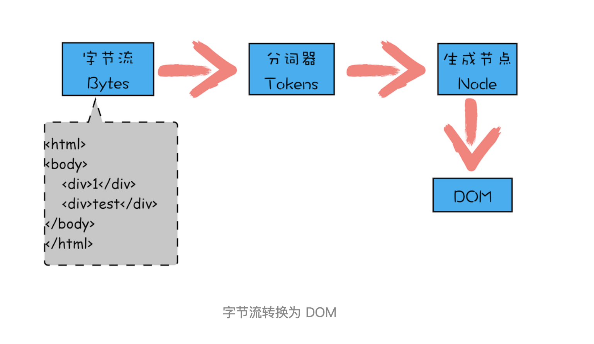

### 垃圾回收机制
- ESP指针：记录调用栈当前执行状态的指针
- 当一个函数执行结束后，JavaScript引擎会通过想下移动ESP来销毁该函数保存在调用栈中的执行上下文，但是该执行上下文中存在堆中的数据此时并没有销毁
- V8把堆分为新生代和老生代两个区域，新生代存放的是生存时间短的对象，老生代中存放生存时间久的对象；副垃圾回收器主要负责回收新生代的垃圾回收，主垃圾回收器主要负责老生代的垃圾回收
- 工作流程：
  - 第一步是标记空间中活动对象和非活动对象。所谓活动对象就是还在使用的对象，非活动对象就是可以进行垃圾回收的对象。
  - 第二步是回收非活动对象所占据的内存。其实就是在所有的标记完成之后，统一清理内存中所有被标记为可回收的对象。
  - 第三步是做内存整理。一般来说，频繁回收对象后，内存中就会存在大量不连续空间，我们把这些不连续的内存空间称为内存碎片。当内存中出现了大量的内存碎片之后，如果需要分配较大连续内存的时候，就有可能出现内存不足的情况。所以最后一步需要整理这些内存碎片，但这步其实是可选的，因为有的垃圾回收器不会产生内存碎片，比如接下来我们要介绍的副垃圾回收器。

### V8执行JavaScript代码
- V8 依据 JavaScript 代码生成 AST 和执行上下文，再基于 AST 生成字节码，然后通过解释器执行字节码，通过编译器来优化编译字节码


### 浏览器事件循环机制
- 事件循环机制：
  - 所有同步任务都在主线程上执行，形成一个执行栈。
  - 主线程之外，还存在一个`任务队列`（task queue）。只要异步任务有了运行结果，就在"任务队列"之中放置一个事件。
  - 一旦`执行栈`中的所有同步任务执行完毕，系统就会读取`任务队列`，看看里面有哪些事件。那些对应的异步任务，于是结束等待状态，进入执行栈，开始执行。
  - 主线程不断重复上面的第三步。
  - 补充：异步任务细分为宏任务和微任务，`微任务优先级高于宏任务，所以微任务会先进入执行栈，然后再是宏任务进入执行栈，如此循环`
- 微任务：Process.nextTick、`Promise.then catch finally`、MutationObserver、async/await

- 与node事件循环机制的差异
  - 差异体现在nodeV10之前。`浏览器是执行完一个宏任务就会去清空微任务队列；node则是将同源的宏任务队列执行完毕后再去清空微任务队列；`另外,宏任务内若嵌套同源宏任务，仍会放进一个队列，但是执行将会放在下一次事件循环；
- example
```js
console.log(1);

setTimeout(() => {
    console.log(2)
    new Promise((resolve) => {
        console.log(6);
        resolve(7);
    }).then((num) => {
        console.log(num);
    })
});

setTimeout(() => {
    console.log(3);
       new Promise((resolve) => {
        console.log(9);
        resolve(10);
    }).then((num) => {
        console.log(num);
    })
    setTimeout(()=>{
    	console.log(8);
    })
})

new Promise((resolve) => {
    console.log(4);
    resolve(5)
}).then((num) => {
    console.log(num);
    new Promise((resolve)=>{
    	console.log(11);
    	resolve(12);
    }).then((num)=>{
    	console.log(num);
    })
})
```
- 答案：左边是浏览器运行结果，右边是node8运行结果


### 浏览器渲染流程
- 关键渲染路径：是指浏览器将HTML、CSS、JavaScript转化为屏幕上所呈现出来的元素所经历的一系列操作
- 渲染关键的五大步骤：构建DOM  构建CSSOM   构建渲染树   布局   绘制
  - `浏览器获取HTML并开始构建DOM`
  - `获取CSS并开始构建CSSOM`
  - `将DOM跟CSSOM结合，创建渲染树(Render tree)`
  - `布局，找到所有内容都处于网页哪个位置`
  - `绘制，浏览器开始在屏幕上绘制像素`
- DOMContentLoaded 事件触发代表初始的 HTML 被完全加载和解析，不需要等待 CSS，JS，图片加载。Load 事件触发代表页面中的 DOM，CSS，JS，图片已经全部加载完毕。
- 总结
  - 渲染路径有五大步骤：构建DOM -> 构建CSSOM -> 构建渲染树 -> 布局 -> 绘制
  - GUI渲染线程与JS引擎线程互斥
  - CSS的加载速度与构建CSSOM的速度将直接影响首屏渲染速度。
  - JS不只是阻塞 DOM 的构建，它会导致 CSSOM 也阻塞 DOM 的构建。
  - CSS 放头部，JS 放底部可以提高页面的性能

  
### DOM树
- 从网络传给渲染引擎的 HTML 文件字节流是无法直接被渲染引擎理解的，所以要将其转化为渲染引擎能够理解的内部结构，这个结构就是 DOM
  - 从页面的视角来看，DOM 是生成页面的基础数据结构
  - 从 JavaScript 脚本视角来看，DOM 提供给 JavaScript 脚本操作的接口，通过这套接口，JavaScript 可以对 DOM 结构进行访问，从而改变文档的结构、样式和内容
  - 从安全视角来看，DOM 是一道安全防护线，一些不安全的内容在 DOM 解析阶段就被拒之门外了

- 通过分词器产生的新 Token 就这样不停地压栈和出栈，整个解析过程就这样一直持续下去，直到分词器将所有字节流分词完成


### 从发起URL开始，到首次显示页面的内容

- 概述：
  - 用户输入url并回车
  - 浏览器进程检查url，组装协议，构成完整的url
  - 浏览器进程通过进程间通信（IPC）把url请求`发送给网络进程`
  - 网络进程接收到url请求后`检查本地缓存`是否缓存了该请求资源，如果有则将该资源返回给浏览器进程
  - 如果没有，网络进程向web服务器`发起请求`（网络请求），请求流程如下：
    - `进行DNS解析，获取服务器ip地址，端口`
    - 利用ip地址和服务器`建立tcp连接`
    - `构建请求头信息`
    - `发送请求头信息`
    - 服务器响应后，网络进程接收响应头和响应信息，并`解析响应内容`
  - 网络进程解析响应流程；
    - 检查状态码，如果是301/302，则需要重定向，从Location自动中读取地址，重新进行第4步 （301/302跳转也会读取本地缓存吗？这里有个疑问），如果是200，则继续处理请求。
    - 200响应处理：检查响应类型Content-Type，如果是字节流类型，则将该请求提交给下载管理器，该导航流程结束，不再进行后续的渲染，如果是html则通知浏览器进程准备渲染进程准备进行渲染。
  - `准备渲染进程`
    - 浏览器进程检查当前url是否和之前打开的渲染进程根域名是否相同，如果相同，则复用原来的进程，如果不同，则开启新的渲染进程
  - 传输数据、更新状态: `提交文档，就是指浏览器进程将网络进程接收到的 HTML 数据提交给渲染进程`
    - 渲染进程准备好后，浏览器向渲染进程发起“提交文档”的消息，渲染进程接收到消息和网络进程建立传输数据的“管道”
    - 渲染进程接收完数据后，向浏览器发送“确认提交”
    - 浏览器进程接收到确认消息后更新浏览器界面状态：安全、地址栏url、前进后退的历史状态、更新web页面
  - 提交数据之后渲染进程会创建一个空白页面(通常把这段时间称为解析白屏)，并等待CSS文件和JavaScript文件的加载完成，生成CSSOM 和 DOM，然后合成布局树，最后经过一系列的步骤准备`首次渲染`
  - 等首次渲染完成之后，就开始进入完整页面的生成阶段，页面会一点点被绘制出来
  
### 缩短白屏时长策略
  - 但并不是所有的场合都适合内联，那么还可以尽量减少文件大小，比如通过 webpack 等工具移除一些不必要的注释，并压缩 JavaScript 文件。
  - 还可以将一些不需要在解析 HTML 阶段使用的 JavaScript 标记上 sync 或者 defer。
  - 对于大的 CSS 文件，可以通过媒体查询属性，将其拆分为多个不同用途的 CSS 文件，这样只有在特定的场景下才会加载特定的 CSS 文件
